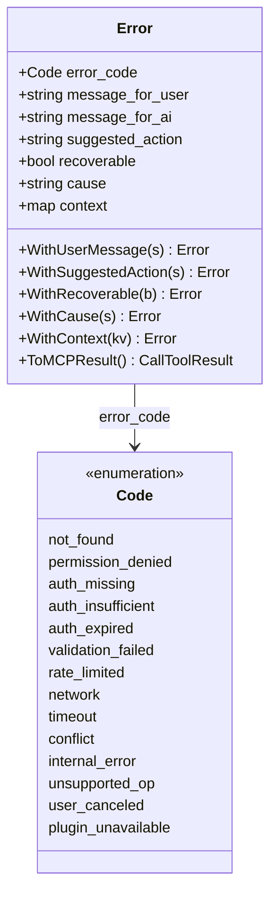
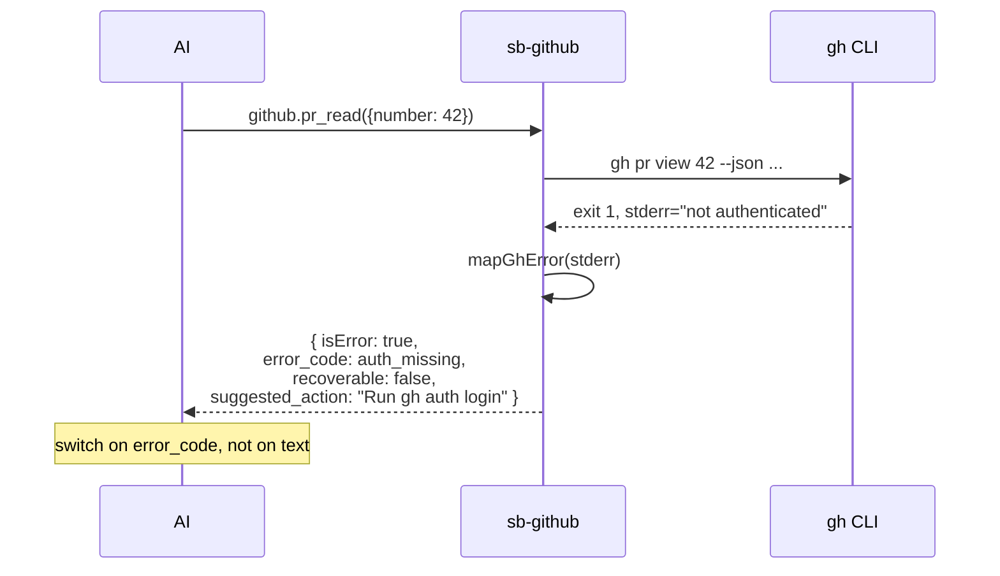

# Architecture: structured error codes

AI client harnesses parse error text to decide next-step ("retry?",
"ask user?", "fall back?"). Each plugin used to emit ad-hoc error
shapes; the shared `internal/errcodes` package standardises a typed
vocabulary so AI can `switch` on `error_code` instead of substring-
matching prose.

## Vocabulary

Fourteen codes covering the failure space:

| Code | Recoverable? | Typical cause |
|---|---|---|
| `not_found` | no | Resource doesn't exist (file / repo / table / etc). |
| `permission_denied` | no | Permission gate refused (write_files not granted, branch protection, etc). |
| `auth_missing` | no | No credentials at all. |
| `auth_insufficient` | no | Scope too narrow. |
| `auth_expired` | **yes** | Re-auth then retry. |
| `validation_failed` | no | Bad input (missing required arg, wrong format). |
| `rate_limited` | **yes** | Back off and retry later. |
| `network` | **yes** | Transport failure (DNS, connection, TLS). |
| `timeout` | **yes** | Deadline exceeded. |
| `conflict` | no | State conflict (merge conflict, version skew). |
| `internal_error` | no | Unexpected exception, parse failure, programmer bug. |
| `unsupported_op` | no | Operation isn't available on this backend. |
| `user_canceled` | no | The user said no. |
| `plugin_unavailable` | **yes** | Plugin / external dependency offline. |

Default `recoverable` flag per code (overridable via
`WithRecoverable(bool)`).

## Wire shape



Example JSON body the AI sees in `CallToolResult.content[0].text`:

```json
{
  "error_code": "auth_missing",
  "message_for_user": "Please log in.",
  "message_for_ai": "gh is not authenticated",
  "suggested_action": "Run `gh auth login`.",
  "recoverable": false,
  "cause": "could not find any credentials",
  "context": {"repo": "owner/x"}
}
```

`message_for_user` is what an end-user-facing surface would show;
`message_for_ai` is what the AI sees in the tool result.
`suggested_action` is action-oriented ("re-auth via `gh auth login`")
not just descriptive.

## Error flow (sb-github example)



## Construction (Go side)

```go
import "SystemBridge/internal/errcodes"

return errcodes.New(errcodes.NotFound, "PR #42 not found").
    WithSuggestedAction("Verify the PR exists with github.pr_list").
    WithContext(map[string]any{"number": 42, "repo": "o-codify/x"}).
    ToMCPResult(), nil
```

Or shorthand:

```go
errcodes.Newf(errcodes.Network, "GET %s: %v", url, err).ToMCPResult()
```

## Adoption

Existing tools keep working with their ad-hoc error shapes (`{success:
false, error: "..."}`). New tools use `errcodes`. Existing tools migrate
when touched. Migration is **not** big-bang.

Currently adopted in:

- `sb-github` — every gh stderr is mapped to a typed code via
  `mapGhError`.
- `sb-research` — every adapter routes HTTP failures through
  `httpGetJSON`.
- `cmd/sb/watch.go` — watch.poll / status return typed `not_found`.

## See also

- [Architecture: risk labels](architecture-risk-labels.md)
- [Plugin: github](plugins/github.md) — example of full adoption
- `internal/errcodes/errcodes.go`
