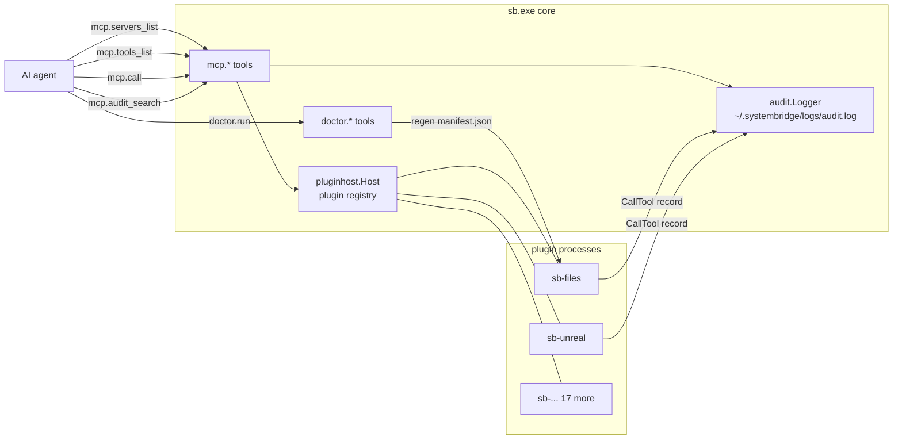

# Architecture: MCP self-introspection

Core-level `mcp.*` and `doctor.*` tools — diagnostics and discovery for
the MCP topology itself. Lives in `cmd/sb/` (not as a plugin) because
the data lives in core: `pluginhost.Host` owns the plugin registry,
the audit logger owns the log file.



Filed because v1.14.0 hotfix loop required hand-crafting JSON-RPC to
`sb.exe`'s stdin to verify a fix end-to-end. That should be a tool, not
a workaround.

## Tools (`mcp.*`)

| Tool | Purpose |
|---|---|
| `mcp.servers_list()` | List every connected plugin: `{name, version, description, status, queue_depth, idle_since_ms, exec_path, tool_count}`. |
| `mcp.tools_list(server?, contains?)` | Flat inventory across plugins (or one). Each tool: `{server, name, full_name, description, risk_level?}`. |
| `mcp.call(tool, args?)` | Invoke a tool by namespaced name. Useful for testing or for tools whose schema the harness hasn't loaded. |
| `mcp.audit_search(contains?, since_ms?, limit?)` | Grep `~/.systembridge/logs/audit.log`. |
| `mcp.stats(window_min?)` | Per-tool call counts + p50/p95 + error rate over a window. |

## Tools (`doctor.*`)

`doctor.run(fix?)` — health check + auto-fix. Surfaces the failure
modes that bit the v1.14.0 hotfix loop:

| Check | Detect | Fix (when `fix=true`) |
|---|---|---|
| `plugin_tilde_backups` | `*.exe~` under `bin/plugins/` (Windows lock-fallback leftover) | Delete them. |
| `manifest_drift` | `mtime(plugin.exe) > mtime(manifest.json) + 1s` (someone did `go build` without regenerating sidecar) | Re-run `--print-manifest > manifest.json`. |
| `stale_sb_processes` | More than 2 `sb.exe` running | Report only (killing the host's own sb.exe would be self-defeating). |

Returns `{checks: [{name, ok, message, fixable, fix_applied?, fix_message?}], summary: {total, ok, failing, fixed}}`.

End-to-end verified: cleaned 10/10 stale `.exe~` backups from the
build that produced this doc system.

## Pre-flight `py_compile` (`scripts/build.sh`)

After v1.14.0's walrus-in-dict-key SyntaxError broke every unreal_*
tool, the build script now py_compile's every embedded `*.py` under
`cmd/`. A SyntaxError fails the build rather than shipping a runtime
landmine.

```bash
for py in $(find ./cmd -name '*.py'); do
    "$PY_BIN" -m py_compile "$py" || exit 1
done
```

## Audit log

JSON-Lines at `~/.systembridge/logs/audit.log`. Each entry includes
timestamp, server, tool, status, duration_ms, args summary (no full
content), error code if any.

`mcp.audit_search` reads it; `sb logs --follow` tails it; `sb stats`
aggregates it. Risk_level is recorded alongside the tool name so
"high-risk ops this session" slicing is trivial.

## See also

- `cmd/sb/mcp.go` — `mcp.*` handlers
- `cmd/sb/doctor_run.go` — doctor implementation
- [Architecture: risk labels](architecture-risk-labels.md)
