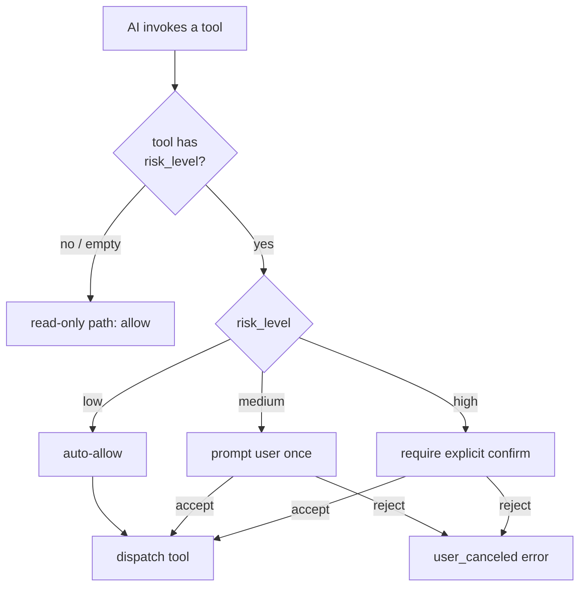

# Architecture: risk labels on write tools

Every tool declaration may carry a `risk_level` ∈ `low / medium / high
/ ""` (empty = read-only). AI client harnesses can implement risk-based
confirm policies: auto-allow low, prompt on medium, require explicit
confirmation on high.

Coarser-grained than per-call introspection (we don't try to derive
risk from arguments — "would `rm -rf /tmp/foo` vs `/etc/passwd` be
different?") and finer than the binary `write_*` permission gate.

## Decision flow at the AI client



The SB core does **not** implement the confirm policy itself — it exposes
`risk_level` and lets the AI client decide. SB only enforces the
binary `write_*` permission gate.

## Vocabulary

| Risk | Semantic | Examples |
|---|---|---|
| `low` | Additive, easily reversed | comment, label add, `files.append`, `files.create_dir`, `clipboard.write`, `github.pr_comment`, `github.pr_review`, `github.issue_create` |
| `medium` | Mutation with structured undo | edit, set, close, disable, `files.write` (overwrite), `files.move`, `files.edit`, `config.set`, `db.query` (UPDATE), `docker.exec`, `docker.stop`, `github.pr_create`, `github.pr_close`, `github.workflow_dispatch`, `github.run_cancel` |
| `high` | Destructive / irreversible | delete, drop, merge, force-push, `files.delete`, `config.unset`, `db.redis_del`, `docker.rm`, `docker.image_rm`, `docker.compose_down`, `github.pr_merge`, `github.release_create` |

## Declaration

In `manifest.ToolDecl`:

```go
{Name: "delete", Description: "Delete file or directory. Idempotent.", RiskLevel: "high"},
{Name: "append", Description: "Append bytes to a file.", RiskLevel: "low"},
{Name: "stat",   Description: "File metadata."}, // empty = read-only
```

Validated by `manifest.IsValidRiskLevel` — bad values reject at plugin
startup.

## Surface

- `mcp.tools_list({server, contains})` returns `risk_level` per tool.
- Audit log records risk_level alongside tool name.
- AI clients can slice "high-risk calls this session" via
  `mcp.audit_search` + filter.

Verified end-to-end:

```
mcp.tools_list({server: "files", contains: "delete"})
→ files.delete risk=high
```

## Currently tagged (after the 6-ship)

| Plugin | Tools |
|---|---|
| files | append:low, create_dir:low, write:medium, edit:medium, move:medium, archive_extract:medium, delete:high |
| config | set:medium, merge:medium, unset:high |
| db | query:medium, redis_set:medium, redis_del:high |
| docker | start:low, stop:medium, restart:medium, exec:medium, image_pull:medium, compose_up:medium, compose_build:medium, rm:high, image_rm:high, compose_down:high |
| github | pr_review:low, pr_comment:low, issue_create:low, issue_reopen:low, issue_comment:low, repo_topics:low; pr_create:medium, pr_close:medium, issue_close:medium, workflow_dispatch:medium, run_rerun:medium, run_cancel:medium, release_upload:medium; pr_merge:high, release_create:high |

## Non-goals

- Dynamic risk from args. Static labels only.
- Per-call risk override.
- Auto-policy generation (allow/deny script from the registry).

## See also

- `internal/manifest/manifest.go` — `ToolDecl.RiskLevel`, `IsValidRiskLevel`
- [Architecture: structured errors](architecture-errcodes.md)
- [MCP introspection](architecture-mcp-introspection.md)
