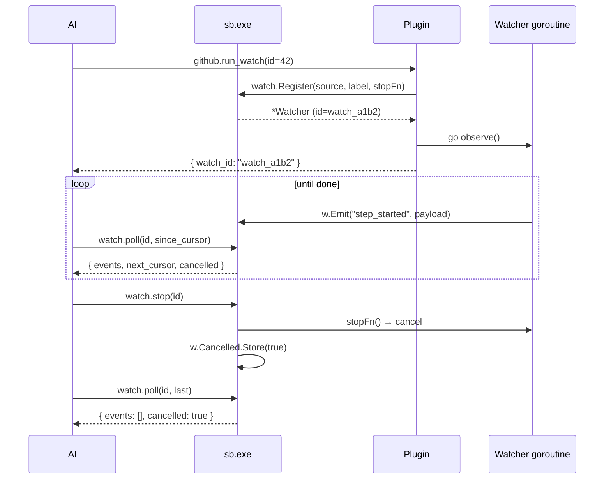

# Architecture: watch / streaming pattern

Long-running observers ("watchers") — CI follows, build watches, file
watches, render queue progress, PIE telemetry. Pure request/response
or `tasks.start` async doesn't fit: AI wants to **drain events as they
arrive**.

## Convention



Buffer caps at **1000 events** per watcher (oldest dropped if full).

## Core tools (`cmd/sb/watch.go`)

| Tool | Purpose |
|---|---|
| `watch.list()` | All watchers across plugins. |
| `watch.poll(id, since_cursor?, max?)` | Drain events since cursor. Returns `{events, next_cursor}`. Idempotent on cursor. |
| `watch.stop(id)` | Cancel a watcher. Idempotent. |
| `watch.status(id)` | Snapshot of one watcher. |

## Plugin-side API (`internal/watch`)

```go
import "SystemBridge/internal/watch"

w := watch.Default().Register("github", "run #42 follow", func() {
    // stop callback — called by watch.stop
    close(quitCh)
})

go func() {
    for { ... loop ...
        w.Emit("step_started", map[string]any{"step": name})
    }
}()

return "{watch_id: " + w.ID + "}"
```

`Register` returns a `*Watcher` with auto-assigned ID (`watch_a1b2`).
`Emit` is safe to call from any goroutine.

## Event shape

```json
{
  "cursor": 42,
  "kind": "step_succeeded",
  "ts": "2026-06-08T22:30:00Z",
  "payload": {"step": "build", "duration_ms": 12345}
}
```

`cursor` is monotonically increasing per watcher; `since_cursor` is a
cursor value, not a timestamp.

## Adopters (planned)

- `sb-github.run_watch(id)` — polls run status every 3s
- `sb-build.tests_watch(filter)` — streams test progress live
- `sb-docker.compose_logs_follow(file)` — tails logs
- `sb-unreal.pie_watch()` — already exists, can conform

## Non-goals

- Server-Sent Events (SSE). Polling is sufficient.
- Cross-plugin event federation.
- Persistent watch state across `sb.exe` restarts.

## See also

- `internal/watch/watch.go` — registry implementation
- `cmd/sb/watch.go` — MCP tools
