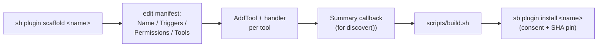

# Extending SystemBridge

How the codebase is laid out and how to add capability — a new tool on an
existing plugin (the common case), or a whole new plugin. For the runtime
architecture (core ↔ plugin wire format, lifecycle, permissions) see
[architecture](architecture.md); for the per-plugin catalog see
[plugins index](plugins/index.md).

## Repository layout

```
cmd/
  sb/                     core daemon + CLI (install, plugin mgmt, tasks,
                          secrets, views, attachments, doctor)
  sb/skill/systembridge/  the AI skill (SKILL.md + references), go:embed'd
  sb-<name>/              one directory per plugin — a standalone Go binary
  sb-unreal/
    companion/            embedded UE C++ plugin source (.uplugin + Source/)
    sb_helpers.py         embedded Python helper module (go:embed)
internal/                 shared internals — errcodes, audit, privacy,
                          plugindir, pluginhost, triggers, manifest, …
pkg/sdk/                  the plugin-authoring SDK every cmd/sb-<name> imports
scripts/build.sh          the canonical builder (see below)
bin/sb.exe                built core
bin/plugins/<name>/       built plugin + its sidecar manifest.json
```

One plugin = one `cmd/sb-<name>/` directory = one Go binary that speaks MCP
over stdio. Core discovers it by reading `bin/plugins/<name>/manifest.json`
**before** spawning it (so triggers can be evaluated cheaply).

## The build is canonical: `scripts/build.sh`

Always build with `scripts/build.sh` — never a bare `go build -o
bin/plugins/...`. The script does three things a raw build skips, each of
which breaks the client if missing:

1. Regenerates every `bin/plugins/<name>/manifest.json` by running
   `<name>.exe --print-manifest`. A stale manifest → `doctor` reports
   `manifest_drift` and the client never sees the new tool.
2. Sweeps `.exe~` backups (Go on Windows leaves them when the daemon holds
   the old binary).
3. `py_compile`-checks every embedded `*.py` under `cmd/` (the sb-unreal
   helper) so a Python syntax error is a build failure, not a runtime one.

It also refuses to run while `UnrealEditor.exe` is open (a live editor pins
the companion DLL — see the sb-unreal section).

## Add a tool to an existing plugin

The common case. Three edits in `cmd/sb-<name>/`, then rebuild:

1. **Declare it in the manifest.** Add a `manifest.ToolDecl` to the plugin's
   `buildManifest()` `Tools` slice — `{Name, Description, Risk}`. This is
   what core reads from the sidecar to route and gate the call.
2. **Register the schema + handler.** Call `plugin.AddTool(mcp.NewTool(...),
   handler)` with the typed parameter schema.
3. **Implement the handler.** `func(ctx, *sdk.Plugin, mcp.CallToolRequest)
   (*mcp.CallToolResult, error)` — validate args, do the work, return
   `sdk.JSONResult(...)` or `sdk.ErrResult(...)`.

Then `bash scripts/build.sh` to rebuild + regenerate the manifest.

### Conventions every write tool follows

- **Risk label** — `Risk: "safe" | "moderate" | "destructive"` on the
  `ToolDecl`. See [risk labels](architecture-risk-labels.md).
- **Structured errors** — return failures through the
  [`internal/errcodes`](architecture-errcodes.md) vocabulary, not ad-hoc
  strings.
- **A reader for every writer** — every mutating tool ships a companion
  read tool so the result is verifiable (e.g. a `set_*` has a `get_*`).

## Add a new plugin



1. **Scaffold**: `sb plugin scaffold <name>` generates the skeleton (in-tree
   `cmd/sb-<name>/` or standalone).
2. **Manifest**: set `Name`, `Description`, `Triggers` (when the plugin
   activates — `AlwaysActive`, `FilesPresent`, or `Processes`),
   `Permissions` (enforced by core at call time), `Lifecycle.Killable`, and
   the `Tools` list.
3. **Summary callback**: return a small map for `discover()` — the cheap
   per-plugin snapshot the agent reads once per turn.
4. **Build + install**: `scripts/build.sh`, then `sb plugin install <name>`
   (built-ins are auto-trusted; third-party plugins need explicit consent +
   SHA256 pin).

Minimal plugin:

```go
func main() {
    plugin, _ := sdk.New(&manifest.Manifest{
        Name:        "myplugin",
        Description: "Does a useful thing",
        Permissions: []string{"read_files:project"},
        Triggers:    manifest.Triggers{FilesPresent: []string{"*.myproject"}},
        Tools:       []manifest.ToolDecl{{Name: "do_something", Risk: "safe"}},
    }, summary)
    plugin.AddTool(
        mcp.NewTool("do_something", mcp.WithString("arg", mcp.Required())),
        handleDoSomething,
    )
    plugin.Run()
}
```

The SDK supplies `--print-manifest` (sidecar generation at build time),
`EmitEvent`, `SetKillable`, `SetShutdownHandler`, and `.senseignore`-aware
helpers. See `pkg/sdk/`.

## sb-unreal specifics

`sb-unreal` is the one plugin with two extra layers beyond Go:

- **Embedded Python** (`cmd/sb-unreal/sb_helpers.py`, `go:embed`) — most
  unreal tools are a thin Go schema that dispatches into a
  `sb_helpers.<fn>(...)` call run inside the live editor via Python Remote
  Execution. Truncate exception `repr` (a full traceback can blow the MCP
  output limit). `build.sh` `py_compile`-guards it.
- **C++ companion** (`cmd/sb-unreal/companion/`) — for operations Python
  can't reach. Its version lives **only** in
  `SystemBridgeCompanion.uplugin` (`VersionName`), read at runtime via
  `IPluginManager`; bump it only when the companion C++ itself changes, not
  on every sb release. Build the DLL with `RunUAT BuildPlugin` — and close
  the editor first (`unreal_editor_quit`), since a live editor holds the
  DLL open. Full lifecycle + version timeline:
  [companion reference](unreal/companion.md).

## Verify before you commit

- `go test ./...`
- For sb-unreal changes: `bin/plugins/unreal/unreal.exe --selftest`
  (confirms every tool registers).
- A new write tool: exercise it AND its reader against a real target, not
  just a unit test.

## Cross-references

- [architecture](architecture.md) — core ↔ plugin wire format, lifecycle,
  manifest schema.
- [plugins index](plugins/index.md) — the per-plugin catalog.
- [risk labels](architecture-risk-labels.md),
  [error codes](architecture-errcodes.md),
  [MCP introspection](architecture-mcp-introspection.md),
  [watch / streaming](architecture-watch.md) — cross-cutting conventions.
- [companion reference](unreal/companion.md) — the UE C++ sub-plugin.
