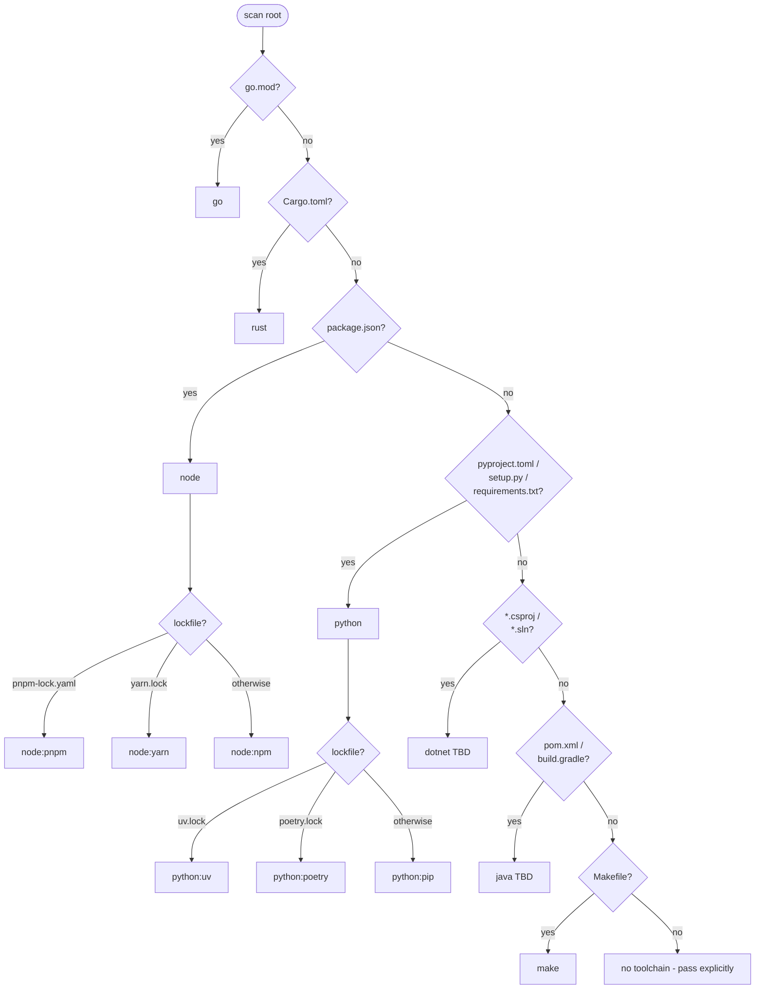

# Plugin: `build`

Auto-detect toolchain build / test / lint / format / deps runner.
Across Go / Node (npm, pnpm, yarn) / Rust (cargo) / Python (pip, uv,
poetry) / Make.

Every adapter emits one shape — `{success, exit_code, toolchain,
duration_ms, output, failures}` — so AI doesn't have to know each
runner's text format.

## Tools

| Tool | Purpose |
|---|---|
| `build.toolchain_detect(root?)` | What toolchain is this project? Returns `{toolchain, others_detected, markers_found}`. |
| `build.build(root?, toolchain?, target?, args?)` | Build. Returns `{success, exit_code, toolchain, duration_ms, output}`. |
| `build.test(root?, toolchain?, filter?, package?, verbose?)` | Run tests with **normalised output**: `{passed, failed, skipped, failures: [{name, file, line, message}]}`. |
| `build.lint(root?, toolchain?, fix?)` | Returns `{issues: [{file, line, severity, code, message}]}`. |
| `build.format(root?, toolchain?, check?)` | Run formatter. `check=true` lists files that would change. |
| `build.deps_outdated(root?, toolchain?)` | `[{name, current, latest, kind}]`. |
| `build.deps_install(root?, toolchain?, name?, version?, kind?)` | Install package or restore from lockfile. |
| `build.deps_upgrade(root?, toolchain?, name?)` | Upgrade one or all. |

## Detection priority



Multiple markers → returns the primary plus lists `others_detected`.

## Test-output parsing

| Toolchain | Source format | Notes |
|---|---|---|
| Go | `go test -json` NDJSON | Per-event `pass` / `fail` / `skip` aggregation; `_test.go:NN:` parsed for file+line. |
| Rust | `cargo test --message-format json` | Per-message `event` field; failure stdout captured. |
| Node | jest / vitest `--json` | Walks `testResults[].assertionResults[].status`. Falls back to text on parse failure. |
| Python | `pytest -q --tb=short` text scrape | Looks for `FAILED ` lines + summary count words. |
| Make | `make test` exit code | No structured parsing; raw output. |

## Lint adapters

| Toolchain | Preferred | Fallback |
|---|---|---|
| Go | `golangci-lint` | `go vet` |
| Rust | `cargo clippy --message-format short` | — |
| Python | `ruff check` | `pyflakes` |
| Node | `npm run lint` (project-configured) | — |

## Example

End-to-end on this project:

```
build.toolchain_detect() → {toolchain: "go", markers: ["go.mod"]}
build.test(package: "./cmd/sb-build") → {passed: 12, failed: 0, duration_ms: 2950}
```

## Cross-references

- [Plugin: code](code.md) — LSP-backed diagnostics (the "did the editor highlight any errors?" view)
- [Architecture: structured errors](../architecture-errcodes.md)
