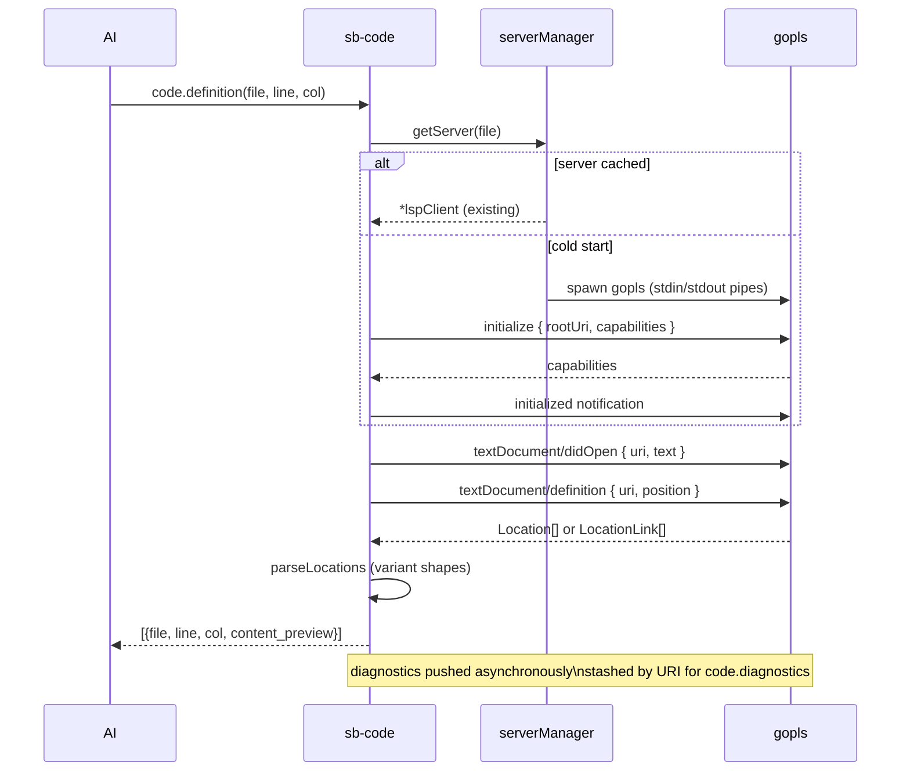

# Plugin: `code`

Language Server Protocol (LSP) bridge — go-to-definition, find-references,
hover, diagnostics, workspace symbols. Replaces ~80% of grep-for-symbol
patterns: LSP knows that `Foo` in a string literal isn't a call to the
function `Foo`.

**v0.1 supports Go (gopls)**. Each additional language adds a small
adapter under the same dispatch.

## Tools

| Tool | Purpose |
|---|---|
| `code.definition(file, line, col)` | Go-to-definition. Returns `[{file, line, col, content_preview}]`. |
| `code.references(file, line, col, include_declaration?)` | All usages: `[{file, line, col, snippet}]`. |
| `code.hover(file, line, col)` | Type info + docstring at position. |
| `code.diagnostics(file?)` | Errors / warnings the language server has published. Empty `file` = workspace-wide. |
| `code.symbols_in_file(file)` | Nested document symbol outline. |
| `code.workspace_symbols(query, root?)` | Project-wide symbol search by name. |
| `code.server_status()` | Status of every managed language server (root, uptime, language). |
| `code.server_restart(root)` | Force-restart the language server for a root. |

## Server lifecycle

`serverManager` caches one `gopls` child process per project root
(detected by walking up for `go.mod`). Started on first call against
any file under that root; reused across calls.

JSON-RPC over stdio with full LSP framing (`Content-Length: N\r\n\r\n`).
`initialize` → `initialized` handshake; `textDocument/didOpen` per file
on demand.

Diagnostics are pushed by the server (notification) and stashed per
URI; `code.diagnostics` returns the most recent set.



## Coordinate convention

LSP uses 0-indexed line + character (codepoints). MCP tools expose
**1-indexed line + col** for AI-friendliness — translated at the
boundary.

## Example

Workspace-wide symbol search:

```
code.workspace_symbols({query: "buildManifest"})
→ count=20, including:
  buildManifest :: cmd/sb-cpp/main.go :37
  buildManifest :: cmd/sb-clipboard/main.go :45
  buildManifest :: cmd/sb-docker/main.go :26
  ...
```

## Setup

Install gopls if not already on PATH:

```
go install golang.org/x/tools/gopls@latest
```

Otherwise the tool returns a structured `gopls not on PATH` error
pointing at the install command.

## Future (v0.2)

| Language | Server |
|---|---|
| Python | pyright |
| TypeScript / JavaScript | typescript-language-server |
| Rust | rust-analyzer |
| C / C++ | clangd |
| C# | csharp-ls |

Each adds an adapter that registers a new factory in `manager.go`.
Detection mirrors `build.toolchain_detect` markers.

## Cross-references

- [Plugin: build](build.md) — runs tests against the same workspace
- [Plugin: semantic](semantic.md) — fuzzy lexical search (complement to LSP exact)
- [Plugin: search](search.md) — literal grep + find-files
