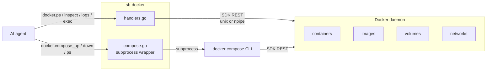

# Plugin: `docker`

Docker container + compose management as MCP tools. Talks to the local
Docker daemon via SDK (`docker/docker` client over unix socket / Windows
named pipe). Compose v2 is shelled out — no stable Go API for the plugin.

## Activation

Always active. Reports `available: false` cleanly when the daemon isn't
running (rather than crashing).

## Tools (23)

### Container lifecycle

| Tool | Purpose |
|---|---|
| `docker.available()` | Probe: `{available, docker_version?, api_version?, os?, arch?}`. |
| `docker.ps(all?, filter?)` | List containers. Default running only. |
| `docker.inspect(container)` | Full inspect JSON. |
| `docker.logs(container, tail?, since?)` | Tail stdout+stderr (strips Docker mux framing). |
| `docker.exec(container, cmd, stdin?, timeout_ms?)` | One-shot exec. **Risk: medium.** |
| `docker.start(container)` | **Risk: low.** Idempotent. |
| `docker.stop(container, timeout_s?)` | **Risk: medium.** Idempotent. |
| `docker.restart(container, timeout_s?)` | **Risk: medium.** |
| `docker.rm(container, force?)` | **Risk: high.** |
| `docker.stats(container?)` | CPU / mem / net snapshot. Empty container = all running. |

### Images / volumes / networks

| Tool | Purpose |
|---|---|
| `docker.images_list(filter?)` | Local images with size + tags + created. |
| `docker.image_inspect(image)` | Full inspect. |
| `docker.image_pull(ref)` | **Risk: medium.** |
| `docker.image_rm(image, force?)` | **Risk: high.** |
| `docker.volumes_list()` | |
| `docker.volume_inspect(name)` | |
| `docker.networks_list()` | |
| `docker.network_inspect(name)` | |

### Compose

| Tool | Purpose |
|---|---|
| `docker.compose_up(file?, services?, detach?)` | **Risk: medium.** Resolves docker-compose.yml from cwd if `file` omitted. |
| `docker.compose_down(file?, remove_volumes?)` | **Risk: high.** |
| `docker.compose_ps(file?)` | Parses `--format json` per-line. |
| `docker.compose_logs(file?, service?, tail?)` | |
| `docker.compose_build(file?, services?, no_cache?)` | **Risk: medium.** |

## Safety

- Read-only by default. Writes gated by `write_docker` permission.
- `compose_*` refuses if the compose file resolves outside `cwd`.
- Plugin starts cleanly when Docker daemon isn't running; tools return
  `docker_unavailable` (errcodes-typed) instead of crashing.

## Architecture

## Implementation notes

- SDK: `github.com/docker/docker/client` with `client.FromEnv` — talks
  via `DOCKER_HOST` or local default.
- Windows: `npipe:////./pipe/docker_engine`. Linux/macOS: `unix:///var/run/docker.sock`.
- Compose: subprocess wrapper around `docker compose <args>`. Uses
  `--format json` per-entry NDJSON parser where available.
- Log framing: Docker stream multiplexes stdout/stderr with an 8-byte
  header per chunk; we strip via `stripMuxHeader`.

## Cross-references

- [Plugin: process](process.md) — for general process management
- [Architecture: risk labels](../architecture-risk-labels.md)
