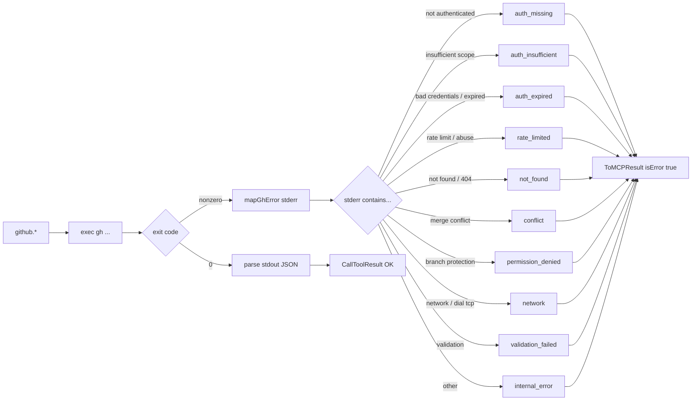

# Plugin: `github`

GitHub operations as MCP tools — PR / issue / repo / CI / release /
search / session. AI doesn't have to shell out to `gh pr list` / `gh
run watch` constantly.

Wraps the `gh` CLI (not the REST SDK) — reuses existing auth state
(`gh auth login` PATs, device flow, etc.). Structured JSON output via
`gh --json` flags where supported. Errors mapped to `errcodes` typed
codes via stderr-text heuristic.

## Tool families (40 tools total)

### Session (3)

| Tool | Purpose |
|---|---|
| `github.whoami` | Current GitHub user + auth status. |
| `github.rate_limit` | REST + GraphQL rate-limit snapshot. |
| `github.scopes_check(required?)` | List token scopes; verify required ones present. |

### PR (10)

| Tool | Risk | Purpose |
|---|---|---|
| `github.pr_list(repo?, state?, author?, limit?)` | — | `[{number, title, head, base, state, author, draft, mergeable, url}]`. |
| `github.pr_read(repo?, number)` | — | Single PR with body, reviewers, statusCheckRollup. |
| `github.pr_create(title, body?, base?, head?, draft?, repo?)` | medium | Returns URL + number. |
| `github.pr_merge(number, method?, delete_branch?, repo?)` | **high** | merge / squash / rebase. |
| `github.pr_close(number, comment?, repo?)` | medium | Close without merging. |
| `github.pr_review(number, action, body?, repo?)` | low | `action` ∈ approve / request_changes / comment. |
| `github.pr_comment(number, body, repo?)` | low | PR-level comment. |
| `github.pr_files(number, repo?)` | — | Files changed with diffstat. |
| `github.pr_diff(number, repo?)` | — | Full unified diff. |
| `github.pr_checks(number, repo?)` | — | CI / Actions check status. |

### Issue (7)

`issue_list` / `read` / `create` (low) / `close` (medium) / `reopen`
(low) / `comment` (low) / `search`.

### Repo (4)

`repo_read` / `list` / `branches` / `tags`.

### CI / Actions (7)

| Tool | Risk | Purpose |
|---|---|---|
| `github.workflow_list(repo?)` | — | All workflows with state. |
| `github.workflow_dispatch(workflow, ref?, inputs?, repo?)` | medium | Trigger `workflow_dispatch`. `inputs` is a JSON object. |
| `github.run_list(repo?, workflow?, limit?)` | — | Recent runs with status + conclusion. |
| `github.run_view(id, repo?)` | — | Run detail with jobs. |
| `github.run_logs(id, failed_only?, repo?)` | — | Last 200 lines of run logs. |
| `github.run_rerun(id, failed_only?, repo?)` | medium | Re-run. |
| `github.run_cancel(id, repo?)` | medium | Cancel a running workflow. |

### Release (3)

| Tool | Risk | Purpose |
|---|---|---|
| `github.release_list(repo?, limit?)` | — | |
| `github.release_view(tag, repo?)` | — | |
| `github.release_create(tag, title?, notes?, draft?, prerelease?, repo?)` | **high** | |

### Search (2)

`search_code` / `search_repos` — both via GitHub search syntax.

## `repo` resolution

`repo` is optional on most tools — defaults to the GitHub remote of
the current cwd via `gh repo view --json nameWithOwner`. Pass
explicitly when working with another repo.

## Structured errors

Stderr is mapped to typed `errcodes.Code` via `mapGhError`:

| `gh` stderr fragment | `error_code` | `suggested_action` |
|---|---|---|
| "not authenticated" / "could not find any credentials" | `auth_missing` | Run `gh auth login`. |
| "scope ... insufficient" | `auth_insufficient` | Run `gh auth refresh -s <scope>`. |
| "bad credentials" / "expired" | `auth_expired` | Run `gh auth login`. |
| "rate limit" / "ratelimit" / "abuse" | `rate_limited` | Wait until reset; check `github.rate_limit`. |
| "not found" / "404" | `not_found` | Verify repo / number / tag exists. |
| "merge conflict" | `conflict` | Resolve conflicts locally. |
| "branch protection" / "protected branch" | `permission_denied` | Check branch protection rules. |
| "403" / "permission" | `permission_denied` | — |
| "network" / "dial tcp" | `network` (recoverable) | — |
| "validation" | `validation_failed` | — |

All other non-zero exits → `internal_error` with truncated stderr.

## Cross-references

- [Plugin: git](git.md) — local git ops
- [Architecture: structured errors](../architecture-errcodes.md)
- [Architecture: risk labels](../architecture-risk-labels.md)
