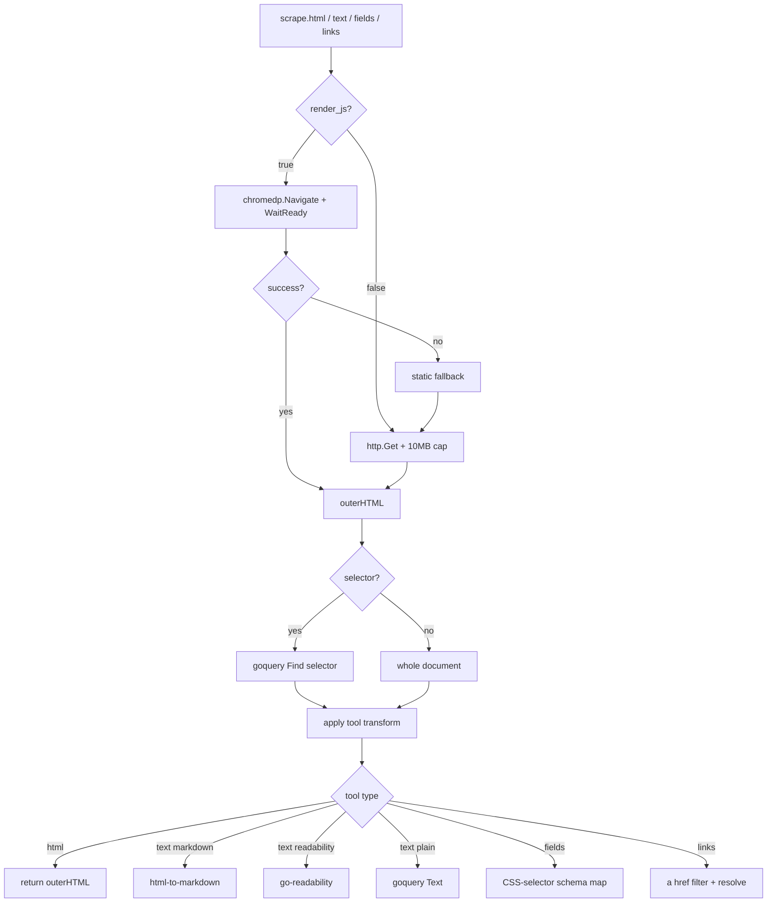

# Plugin: `scrape`

Structured web extraction — fetch + (optional JS render via chromedp) +
selector-based extraction + HTML→markdown / readability. Middle ground
between raw `network.http_request` (no JS, no DOM) and the Chrome MCP
(interactive).

For "read this page", "pull these fields", "map this docs site" workflows.

## Tools

| Tool | Purpose |
|---|---|
| `scrape.html(url, selector?, render_js?, timeout_s?)` | Fetch + render; return outerHTML (matched elements or whole document). |
| `scrape.text(url, selector?, format?, render_js?, timeout_s?)` | Clean text. `format` ∈ `markdown` (default) / `plain` / `readability`. |
| `scrape.fields(url, schema, render_js?, timeout_s?)` | Extract a JSON object. `schema` = `{field: css_selector}`; values become innerText. |
| `scrape.links(url, same_origin?, render_js?, timeout_s?)` | All `<a href>` with text + resolved URL. |
| `scrape.crawl(root_url, max_pages?, max_depth?, same_origin?, schema?, render_js?)` | Multi-page walk; optional per-page field extraction. |
| `scrape.screenshot(url, full_page?, width?, height?, timeout_s?)` | PNG buffer. |

## Examples

Clean markdown of an article:

```
scrape.text({
  url: "https://example.com/article",
  format: "readability"
})
```

Pull product cards:

```
scrape.fields({
  url: "https://shop.example.com",
  schema: "{\"title\":\".product .title\",\"price\":\".product .price\"}"
})
```

Map a docs site (depth 2, same-origin):

```
scrape.crawl({
  root_url: "https://docs.foo.io",
  max_pages: 20,
  max_depth: 2
})
```

## Fetch pipeline



## Implementation notes

- Fetch: stdlib `net/http` for static; `github.com/chromedp/chromedp`
  (already in dep tree for sb-browser) for JS-rendered.
- HTML→markdown: `github.com/JohannesKaufmann/html-to-markdown`.
- Readability: `github.com/go-shiori/go-readability`.
- CSS: `github.com/PuerkitoBio/goquery`.
- Falls back to static fetch when Chrome isn't available — never hard fails.
- Crawl rate-limit: 250ms between requests; cap 100 pages even if asked for more.

## Safety

- Read-only — no permission gate.
- Per-request timeout (default 10s).
- `crawl_site` rate-limits + caps pages — won't DOS a remote.
- Same-origin filter default for crawls.

## Cross-references

- [Plugin: network](network.md) — raw HTTP/TCP/WebSocket
- Chrome MCP (separate) — interactive browser
