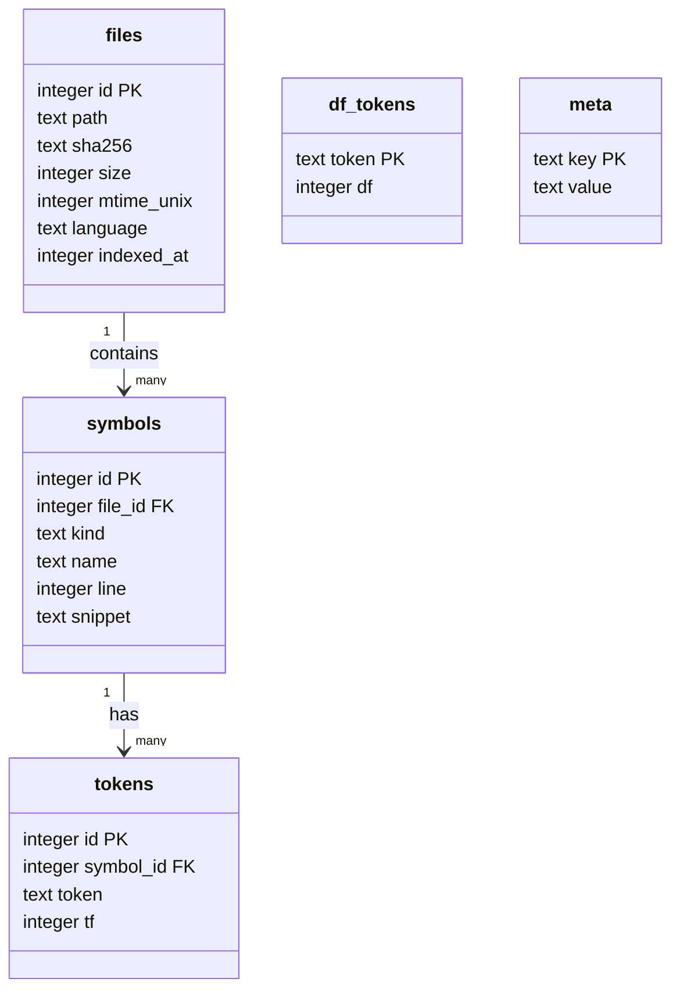

# Plugin: `semantic`

Code search beyond literal grep: **BM25 ranking + identifier-aware
tokenisation** answers fuzzy intent queries on the project's own code.
Per-project SQLite index. No external embedding model.

Strategy: split `parseBlueprintManifest` → `{parse, blueprint, manifest}`
so a query "parse blueprint manifest" matches the function without
lemmatisation. Complements grep (literal) and LSP `workspace_symbols`
(exact symbol).

## Tools

| Tool | Purpose |
|---|---|
| `semantic.index(root?, force?)` | Build / refresh the index. Incremental (skips files whose mtime hasn't changed). Returns `{indexed_files, indexed_symbols, duration_ms, languages, index_size_bytes}`. |
| `semantic.search(query, k?, kind?, language?)` | BM25-ranked hits: `{score, file, line, kind, name, snippet}`. Kind ∈ function / class / file / comment. |
| `semantic.similar(file, k?)` | Files most similar to `file` by token overlap. |
| `semantic.stats(root?)` | Index inventory: files, symbols, languages, indexed_at. |
| `semantic.clear(root?)` | Drop the index. |

## Tokenisation

- Identifier-split: `camelCase`, `snake_case`, `kebab-case`, and
  `SCREAMING_SNAKE` all decompose into the same constituent tokens.
- Compound form preserved as a separate token so exact-match queries
  hit too.
- Acronyms handled: `HTTPServer` → `HTTP`, `Server`.
- Stopwords dropped: generic English + code-noise (`func`, `var`,
  `return`, `if`, …).

## Storage

SQLite at `<project>/.sb_index.sqlite`.



BM25 scoring runs in SQL with idf precomputed from `df_tokens`.

## Languages

Auto-detected from extension: `go`, `python`, `typescript`, `javascript`,
`rust`, `java`, `kotlin`, `ruby`, `swift`, `cpp`, `csharp`, `markdown`,
`yaml`, `toml`, `json`, `sql`, `shell`. Other files skipped.

Files > 1MB skipped (config/log noise).

## Examples

Index this project:

```
semantic.index()
→ {indexed_files: 271, indexed_symbols: 2574, duration_ms: 3729, ...}
```

Find "the function that registers tools":

```
semantic.search({query: "manifest tool registration", k: 5})
→ score=17.02 cmd/sb-unreal/tool_registry_test.go:1 (file)
  score=13.39 internal/pluginhost/host.go:116 (function Plugins)
  score=10.74 internal/views/views.go:55 (function Register)
```

## Future (v0.2)

Optional neural embeddings (e.g. small ONNX model) for true semantic
search. v0.1 BM25 + identifier-aware split covers ~80% of intent
queries on identifier-dense corpora (code).

## Cross-references

- [Plugin: search](search.md) — literal grep + find-files + find-symbol
- [Plugin: code](code.md) — LSP-backed `workspace_symbols`
