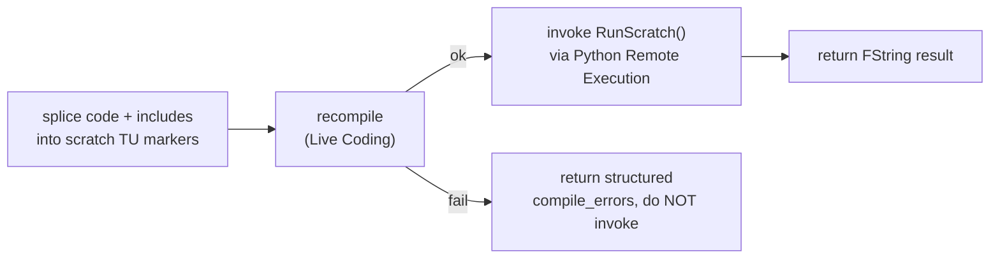

# REQUEST: unreal_run_cpp — execute C++ snippets in the live editor

> **You may be new to SystemBridge.** This request is self-contained, and the
> "Orientation" section at the bottom points you at the exact files and docs
> you need. Read those before building — do **not** guess at the build,
> versioning, or spec conventions; they are all written down.

## What

A SystemBridge tool, `unreal_run_cpp`, that runs an arbitrary **C++ snippet**
inside the running Unreal Editor and returns its result — the C++ analogue of
the existing `unreal_run_python` (which runs arbitrary Python in the editor).
The point is to **prototype and run C++ editor operations on demand without
permanently adding a new C++ binding for every one-off task.**

## The hard constraint — read this first

There is **no C++ interpreter** in Unreal. C++ is compiled ahead of time;
Python works only because UE ships an embedded Python interpreter. So you
**cannot** `eval()` C++ the way `run_python` evals Python.

**Do not** try to embed a C++ interpreter / JIT (Cling, ClangJIT, etc.) — that
path is fragile, non-portable, and out of scope.

The viable mechanism is **recompile-a-fixed scratch function**:

- The companion C++ plugin ships one dedicated "scratch" function with a
  **fixed signature** (e.g. `static FString RunScratch();`) and a wide set of
  pre-`#include`d UE headers, with marker comments around its body.
- The tool splices the caller's snippet into that body, **recompiles via Live
  Coding** (UE's hot-patch), then **invokes** the function and returns its
  result.
- Live Coding patches **function bodies only** — it cannot add new
  `UCLASS`/`UFUNCTION`/reflected types at runtime. That is exactly why the
  scratch function's signature is fixed and pre-declared; only its body
  changes per call.

## Goal

Let an agent execute a one-off native C++ editor operation (full access to UE
reflection / editor APIs) in a single tool call — no hand-editing of companion
source, no permanent binding — accepting that each call costs a compile
(seconds), not the ~milliseconds of `run_python`.

## Behaviour

Inputs:

- `code` — the C++ statements to run. By convention the snippet returns an
  `FString` (JSON is the norm — mirror `run_python`'s `<<<SB_JSON>>>` result
  marker so the Go side can surface structured data).
- `includes` (optional) — extra `#include` lines, spliced into a separate
  marked region at the top of the scratch translation unit.

Operation:

- Splice `code`/`includes` between the marker comments in the scratch module
  source, then trigger compilation (reuse the existing `live_coding_compile`
  tool), wait for success, then call the scratch function through Python Remote
  Execution and return its `FString`.
- On a compile error: return structured diagnostics (parsed `{file, line, code,
  message}`, the same shape `project_build` already produces) and do **not**
  invoke the stale function.

Outputs: `{success, result, compile_errors?, compile_ms}`.

## Key design question you must resolve

Live Coding can only patch **locally-compiled** modules. A **precompiled Rocket
plugin** — which is how the companion is normally installed into the engine
(`Engine/Plugins/Marketplace/SystemBridgeCompanion`) — is a read-only binary
that Live Coding will **not** patch.

So the scratch module has to be **locally compilable**: install it as a
**project-scope** plugin built from source, or carve out a small dedicated
scratch module in the project. Decide which, and document the choice and the
setup steps the tool needs (or performs).

## Acceptance

- `code` like `return FString::Printf(TEXT("{\"len\":%d}"),
  GEditor->GetEditorWorldContext().World()->GetName().Len());` compiles, runs,
  and returns that JSON; the editor does not crash.
- A second call with different `code` rewrites the body and returns a new
  result **without restarting the editor**.
- A snippet that fails to compile returns structured `compile_errors`, the
  function is not invoked, and the editor stays alive.
- The tool carries the **`destructive`** risk label and its description warns
  that arbitrary native code can crash the editor (SystemBridge's crash
  watcher / `editor_restart` can recover it).
- **Wrong**: embedding a C++ interpreter; reporting `success` when the new code
  didn't actually load; trying to add a fresh `UFUNCTION` per call (Live Coding
  can't); a silently crashed editor reported as success.

## Orientation — where everything you need lives (you don't know SystemBridge yet)

SystemBridge is an MCP daemon; the UE plugin is `cmd/sb-unreal/`. Concretely:

- **Companion C++ source** (where new bindings go):
  `cmd/sb-unreal/companion/` — `Source/SystemBridgeCompanion/{Public,Private}/SystemBridgeBindings.{h,cpp}`
  and `SystemBridgeCompanion.Build.cs`. Add the scratch function here.
- **The tool you're mirroring**: `unreal_run_python` and `unreal_live_coding_compile`
  — find their Go registration + handler in `cmd/sb-unreal/` (grep the tool
  names). A helper-backed tool is: a `manifest.ToolDecl` entry + an
  `mcp.NewTool(...)` schema + a handler that dispatches into the editor. The
  Python side lives in `cmd/sb-unreal/sb_helpers.py`.
- **How to add a tool + the conventions** (risk labels, structured errors via
  `internal/errcodes`, a reader for every writer, manifest regeneration):
  read [`docs/extending.md`](../extending.md).
- **Companion build / install / versioning** — do **not** invent a build
  process: read [`docs/unreal/companion.md`](companion.md). The companion is
  rebuilt + deployed by the `unreal_companion_rebuild` MCP tool, and its
  version lives only in `SystemBridgeCompanion.uplugin` (`VersionName`, read at
  runtime via `IPluginManager`) plus `companion_install.go`'s
  `defaultExpectedCompanionVersion`.
- **Repo operating rules** (canonical build = `scripts/build.sh`; close the
  editor before building; version-bump locations): the repo's root
  `CLAUDE.md`. Follow it rather than guessing.
- **Live Coding details + limits**:
  [`docs/unreal/live-coding.md`](live-coding.md).
- **The Remote Execution result-marker convention** (`<<<SB_JSON>>>`):
  [`docs/plugins/unreal.md`](../plugins/unreal.md#sb_json-marker-protocol).

After shipping: add the tool to the unreal plugin catalog
([`docs/plugins/unreal.md`](../plugins/unreal.md)) and the companion version
timeline ([`docs/unreal/companion.md`](companion.md)), then this request can be
deleted.
