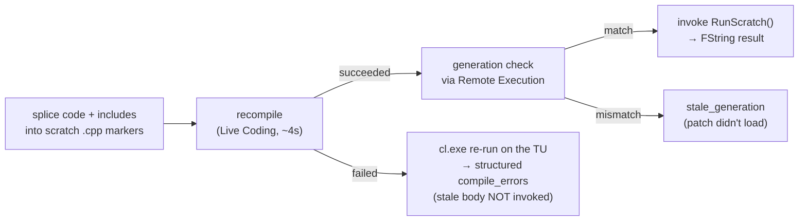

# run_cpp — C++ snippets in the live editor

`unreal_run_cpp` — execute an arbitrary **C++ snippet** inside the running
editor and get its result back: the native analogue of
[`run_python`](index.md). For one-off editor operations that need UE C++
APIs Python can't reach, without permanently adding a companion binding.

See: [unreal deep dive](index.md), [Live Coding](live-coding.md),
[tool catalog](../plugins/unreal.md#c-snippet-execution).

## The mechanism — recompile a fixed scratch function

There is **no C++ interpreter** in UE; C++ is compiled ahead of time. So
`run_cpp` cannot `eval()` — instead it recompiles a dedicated scratch
function and invokes it:



The scratch lives in a dedicated **project-scope source plugin**,
`<Project>/Plugins/SystemBridgeScratch/`, written by the tool itself (no
UAT, no manual setup):

- `USystemBridgeScratchLibrary` ships exactly two `UFUNCTION`s with
  **fixed signatures**: `static FString RunScratch()` (the spliced body)
  and `static FString GetScratchGeneration()` (the stale-patch guard).
  Live Coding patches function **bodies only** — it cannot register new
  `UCLASS`/`UFUNCTION` reflection at runtime, which is exactly why the
  signatures never change per call.
- A wide set of editor headers is pre-`#include`d (Editor.h, AssetRegistry,
  Json, Kismet2, EdGraph, editor subsystems, IPluginManager, …); the
  `Build.cs` links the same module set as the companion plus
  Json/JsonUtilities. Extra `#include` lines go in via the `includes`
  parameter.

### Why project-scope, not the companion

Live Coding only patches **locally-compiled** modules. The companion is
normally a precompiled Rocket plugin under
`Engine/Plugins/Marketplace/SystemBridgeCompanion` — Live Coding will never
patch it. A source plugin inside the project's `Plugins/` builds with the
project editor target and IS patchable. Consequence: `run_cpp` ships
**without touching the companion** — no DLL rebuild, no companion version
bump.

## Usage

```
unreal_run_cpp code=<C++ statements> [includes=<#include lines>]
               [wait_seconds=120] [timeout_seconds=60]
```

The snippet is the body of `FString RunScratch()` — it must end with
`return <FString>;`, JSON content by convention:

```cpp
return FString::Printf(TEXT("{\"len\":%d}"),
    GEditor->GetEditorWorldContext().World()->GetName().Len());
```

Result: `{success, status, generation, result, result_json, compile_ms,
invoke_ms}`. `result_json` is the parsed form when the FString is valid
JSON.

## One-time setup (first call on a project)

The first call writes the scratch plugin source and returns
`status: "scratch_installed"` + `setup_steps` — a brand-new module cannot
be loaded by Live Coding, it needs one full build + editor restart:

1. `unreal_editor_quit` (a full build can't overwrite DLLs a live editor holds)
2. `unreal_project_build` (compiles the SystemBridgeScratch module)
3. `unreal_editor_launch`
4. retry `unreal_run_cpp`

After that, every call is just splice → Live Coding (~4 s) → invoke
(~100 ms). Verify the bring-up with `unreal_run_cpp_status`
(`module_loaded: true`).

Add `Plugins/SystemBridgeScratch/` to the project's `.gitignore` — it is
generated tooling state, not project content.

## Status values

| Status | Meaning |
|---|---|
| `ok` | Compiled, generation verified, invoked. `result` is live. |
| `scratch_installed` | First call: source written; follow `setup_steps`. |
| `scratch_not_loaded` | Source on disk but the module isn't in the running editor (never built / editor predates it). Follow `setup_steps`. |
| `compile_failed` | Snippet didn't compile. `compile_errors` is structured `{file, line, code, message}`; the previous body is still loaded and was **not** invoked. |
| `compile_timeout` | No Live Coding marker within `wait_seconds`. Same causes as [live_coding_compile timeout](live-coding.md#status-values). |
| `stale_generation` | Live Coding said "succeeded" but the editor still runs the previous body — the patch didn't land. Retry; if persistent, full rebuild cycle. |
| `invoke_failed` | Compile fine, invoke round-trip failed — if the snippet crashed the editor, the [crash watcher](crash-recovery.md) relaunches it (~25 s). |
| `blueprint_only_project` | No `Source/*.Target.cs` — UBT can't build an editor target at all. Add one C++ class from the editor first. |
| `editor_not_running` | No editor reachable via Remote Execution. |

## The generation guard

Every call stamps a fresh generation id into
`GetScratchGeneration()`'s body alongside the snippet. After a successful
compile the invoke script reads the **loaded** generation first and only
calls `RunScratch()` on a match. This kills the worst failure mode:
Live Coding reporting success while the editor still runs the old body —
returning the old body's output as the new snippet's result would be
silently wrong. `run_cpp_status` exposes both stamps + `in_sync` for
diagnosis.

## Structured compile errors honestly

UE 5.7.4's Live Coding shows compiler diagnostics **only in the
LiveCodingConsole window** — they reach neither the editor log nor
`LiveCodingConsole.log` (verified: a known-bad snippet logs just
`Live coding failed, please see Live console`). And UBT refuses to build
while Live Coding is active, so `project_build` can't be the fallback.

What works: on failure, `run_cpp` re-runs **cl.exe directly on the scratch
translation unit** using the response file UBT wrote during the setup
build (`SystemBridgeScratchLibrary.cpp.obj.rsp` — source path, include
set, shared PCH, all flags), with outputs redirected to a temp dir and
cwd set to `<UE>/Engine/Source` (the rsp's relative-path root). The MSVC
diagnostics are parsed into the same `{file, line, code, message}` shape
`project_build` produces. Costs ~3 s, failure path only. cl.exe is located
from UBT's own log (toolchain line) with a vswhere fallback; localized
output is transcoded from the OEM codepage.

## Limits

- **Cost**: each call is a Live Coding compile — seconds, not the
  milliseconds of `run_python`. Prefer `run_python` when Python reaches
  the API.
- **Fixed signature**: no parameters in, one FString out. Pass inputs by
  embedding them in `code` (you are generating the source anyway).
- **No new reflection**: a snippet cannot declare working
  `UCLASS`/`UFUNCTION`/`UPROPERTY` — Live Coding can't register them.
  Recurring needs deserve a real [companion binding](companion.md).
- **No new module deps**: `includes` only helps for headers of modules the
  scratch `Build.cs` already links (companion set + Json). A new module
  dep means editing the generated Build.cs + full rebuild — at that point,
  write a companion binding.
- **DESTRUCTIVE**: arbitrary native code runs in-process. A null deref
  crashes the editor — save dirty assets first; recovery is the crash
  watcher or `editor_restart`.
- **C++ projects only** (`Source/*.Target.cs` must exist).

## Cross-references

- [Live Coding reference](live-coding.md) — the compile engine underneath.
- [C++ iteration workflow](../workflows/cpp-iteration.md) — for permanent
  code changes (run_cpp is for one-off operations).
- [companion reference](companion.md) — when a snippet should graduate to
  a real binding.
- [tool catalog](../plugins/unreal.md#c-snippet-execution).
